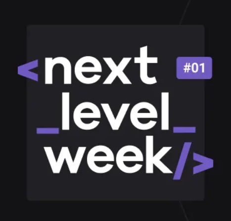

    

<h3 align="center">
  Next Level Week
</h3>

<blockquote align="center">“A chave para a transformação é a continuidade. Continue a Codar!.”</blockquote>

  <a href="#rocket-sobre-o-desafio">Sobre a Next Level Week</a>&nbsp;&nbsp;&nbsp;

## Sobre a Next Level Week
A Next Level Week é uma experiência online oferecida pela Rocketseat 🚀 para alavancar os conhecimentos dxs devs. São 5 episódios recheados com conteúdos variados das tecnologias mais utilizadas em desenvolvimento web. E é mão na massa desde o primeiro episódio!
A proposta é desenvolver um marketplace para a coleta de resíduos e sua reciclagem, disponibilizando os pontos de coleta e também a possibilidade de cadastrar novos pontos de coleta.

### A experiência NLW

Os episódios proporcionam na prática os principais funcdamentos do desenvolvimento web:

- [x] EPISÓDIO 1 - Criação de layout e estilização do HTML da página principal.
- [x] EPISÓDIO 2 - Criação do formulário de cadastro, aplicação de JavaScript e utilização de API de localidades da IBGE.
- [ ] EPISÓDIO 3
- [ ] EPISÓDIO 4
- [ ] EPISÓDIO 5

<h3 align="center">
    
</h3>