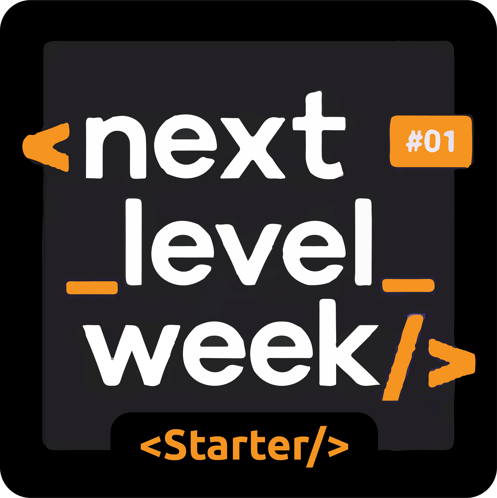

    

<h3 align="center">
  Next Level Week - Starter
</h3>

  
  
  

<blockquote align="center">“A chave para a transformação é a continuidade. Continue a Codar!.”</blockquote>

  <a href="#sobre-a-next-level-week">Sobre a Next Level Week</a>&nbsp;&nbsp;&nbsp;|&nbsp;&nbsp;&nbsp;
  <a href="#apresentação-da-aplicação">Apresentação da aplicação</a>&nbsp;&nbsp;&nbsp;|&nbsp;&nbsp;&nbsp;
  <a href="#a-experiência-nlw">A experiência NLW</a>

## Sobre a Next Level Week
A Next Level Week - Starter é uma experiência online oferecida pela Rocketseat 🚀 para alavancar os conhecimentos dxs devs. São 5 episódios recheados com conteúdos variados das tecnologias mais utilizadas em desenvolvimento web. E é mão na massa desde o primeiro episódio!
A proposta é desenvolver um marketplace para a coleta de resíduos e sua reciclagem, disponibilizando os pontos de coleta e também a possibilidade de cadastrar novos pontos de coleta.

## Apresentação da aplicação

    

## A experiência NLW

Os episódios proporcionam na prática os principais fundamentos do desenvolvimento web:

- [x] EPISÓDIO 1 - Criação de layout e estilização do HTML da página principal.
- [x] EPISÓDIO 2 - Criação do formulário de cadastro, aplicação de JavaScript e utilização de API de localidades da IBGE.
- [X] EPISÓDIO 3 - Finalização do layout do formuário e aplicação JS, criação do modal e aplicação JS e criação da página de resultados.
- [x] EPISÓDIO 4 - Estrutura de pastas, criação do servidor, rota para aplicação e template engine (Nunjucks).
- [x] EPISÓDIO 5 - Instalação sqlite3. Criação de arquivo de banco de dados, criação de tabela no banco de dados, inserção de dados na tabela, consulta da tabela, deletar tabela. Importação de banco de dados para server. Banco de dados nas rotas.

<h3 align="center">
    
</h3>